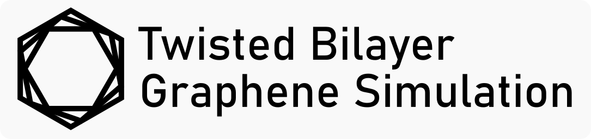

# Twisted Bilayer Graphene Simulation



<div align="center">

[](https://bilayer.graphene.science)
[](https://react.dev/)
[](https://pixijs.com/)
[](https://ui.shadcn.com/)
[](https://aws.amazon.com/lambda/)

</div>

The Twisted Bilayer Graphene Simulation (TBG Sim) is a web-based application designed to model and visualize the unique properties of twisted bilayer graphene systems.
This tool provides an interactive platform for exploring the electronic band structure and moiré patterns that emerge from varying twist angles and strain conditions.

The tools is build using [React 19](https://react.dev/) as the framework, [PixiJS](https://pixijs.com/) for high-performance graphics rendering and [shadcn](https://ui.shadcn.com/) as the UI component library as well as [AWS Lambda](https://aws.amazon.com/lambda/) for creating and diagonalizing the Hamiltonians.

The Bandstructure model is based on a modified Bistritzer–MacDonald Hamiltonian from the paper ["Unusual magnetotransport in twisted bilayer graphene from strain-induced open Fermi surfaces"](https://www.pnas.org/doi/10.1073/pnas.2307151120), I greatly recommend reading it for a deeper understanding of the physics involved.

The Website is hosted on [bilayer.graphene.science](https://bilayer.graphene.science).

## 🔬 Features

### Interactive Visualizations

- **Real-time Moiré Pattern Visualization**: Interactive hexagonal lattice representation using PixiJS
- **Band Structure Plotting**: Dynamic electronic band structure charts with 6-band visualization
- **Responsive Controls**: Real-time parameter adjustment with immediate visual feedback

### Physical Parameters

- **Twist Angle Control**: Adjust the relative rotation between graphene layers
- **Strain Modulation**:
  - Biaxial strain (uniform compression/tension)
  - Uniaxial strain with adjustable direction

## 🚀 Quick Start

### Prerequisites

- Node.js (v18 or higher)
- pnpm (recommended) or npm

### Installation

1. **Clone the repository**

   ```bash
   git clone https://github.com/Jaluus/Twisted-Bilayer-Graphene-Simulation.git
   cd Twisted-Bilayer-Graphene-Simulation
   ```

2. **Install dependencies**

   ```bash
   pnpm install
   ```

3. **Environment Setup**
   Create a `.env` file in the root directory:

   ```env
   VITE_API_URL=https://PathToYourServer.com/api # API endpoint for Hamiltonian calculations
   VITE_CACHE_KEY_PREFIX=bilayer_graphene_cache_ # Prefix for cache keys
   VITE_CACHE_EXPIRY_H=72 # Cache expiry in hours
   ```

4. **Start development server**

   ```bash
   pnpm run dev
   ```

5. **Open in browser**
   Navigate to `http://localhost:5173`

## 📄 License

This project is licensed under the MIT License - see the [LICENSE](LICENSE) file for details.

## Acknowledgments

The backend code is based on work from the authors of ["Unusual magnetotransport in twisted bilayer graphene from strain-induced open Fermi surfaces"](https://www.pnas.org/doi/10.1073/pnas.2307151120). Special thanks to the authors for their contributions to the field of condensed matter physics.
